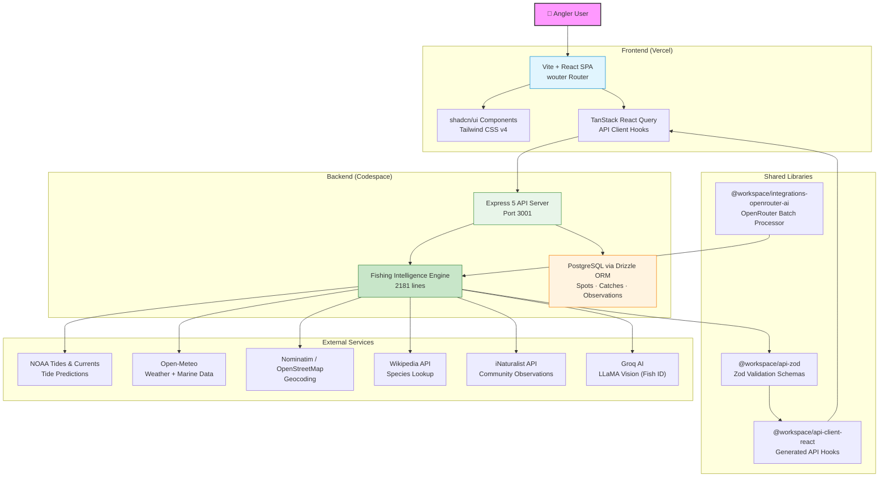

# Coastal Angler Guide — System Architecture



## Search-Location Request Flow

```mermaid
sequenceDiagram
    participant U as 👤 User
    participant D as Dashboard
    component LS as LocationSearch
    participant API as Express API
    participant CL as classifyLocation()
    participant EXT as External APIs
    participant RESP as Response

    U->>D: Types location name
    D->>LS: handleSearch("Lake Conroe")
    LS->>API: POST /api/fishing/search-location
    Note over API: Zod validation
    
    API->>CL: classifyLocation("lake conroe")
    CL-->>API: regionKey: "lake-conroe"<br/>matchType: "exact"
    
    par Species + Bait
        API->>API: Lookup REGION_PROFILES
        API->>API: fillBaitMap() ← SPECIES_BAIT
    and Tide Data
        API->>EXT: getTideData() → NOAA / Lunar sim
    and Weather
        API->>EXT: fetchWeather() → Open-Meteo
    end
    
    alt Unknown Location (estimated)
        API->>EXT: geocodeLocation() → Nominatim
        API->>EXT: lookupFishOnWikipedia()
        API->>EXT: lookupFishOnINaturalist()
    end
    
    API->>RESP: Assemble response
    RESP-->>LS: JSON result
    LS-->>D: Update dashboard cards
    D-->>U: Show conditions, species, bait
```

## Accessible at:
- **Live site**: https://hackathon-2026-alpha.vercel.app
- **API base**: https://fantastic-broccoli-wvr56w66qxq5cg764-3001.app.github.dev
